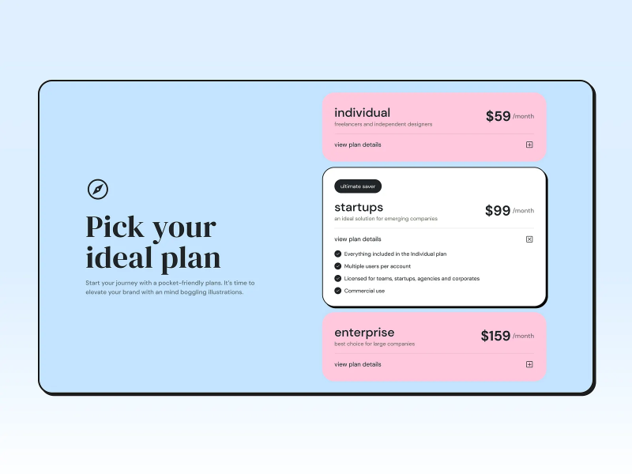
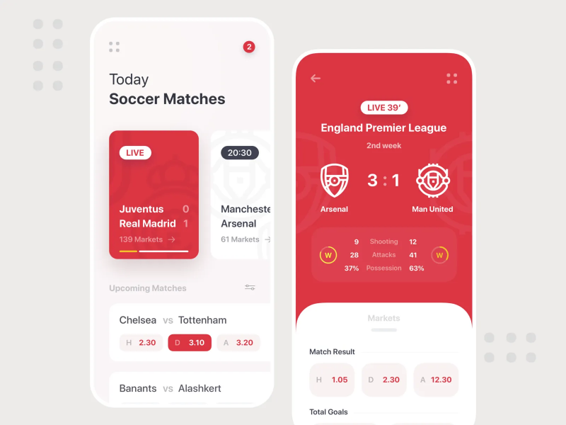
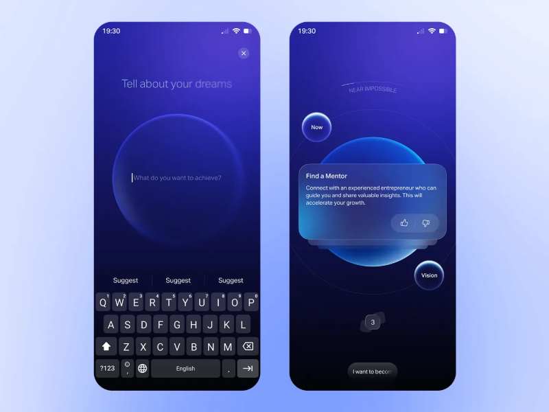
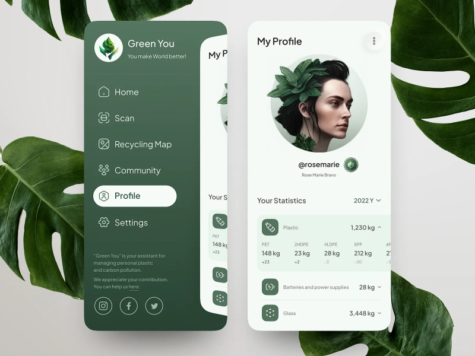
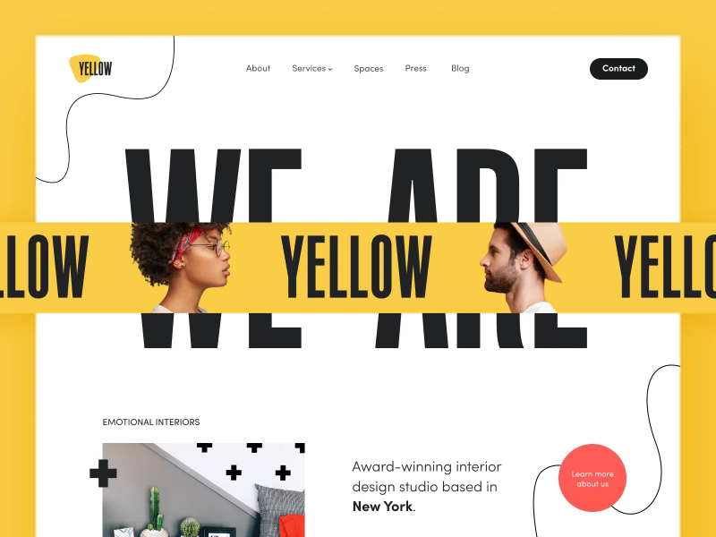
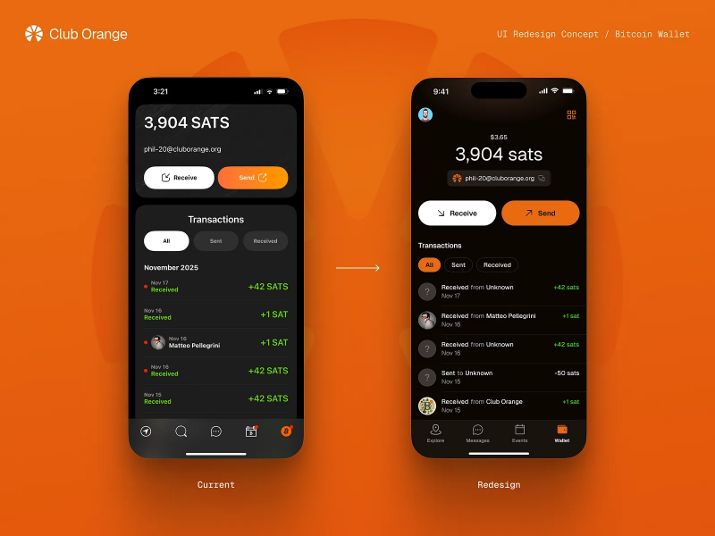
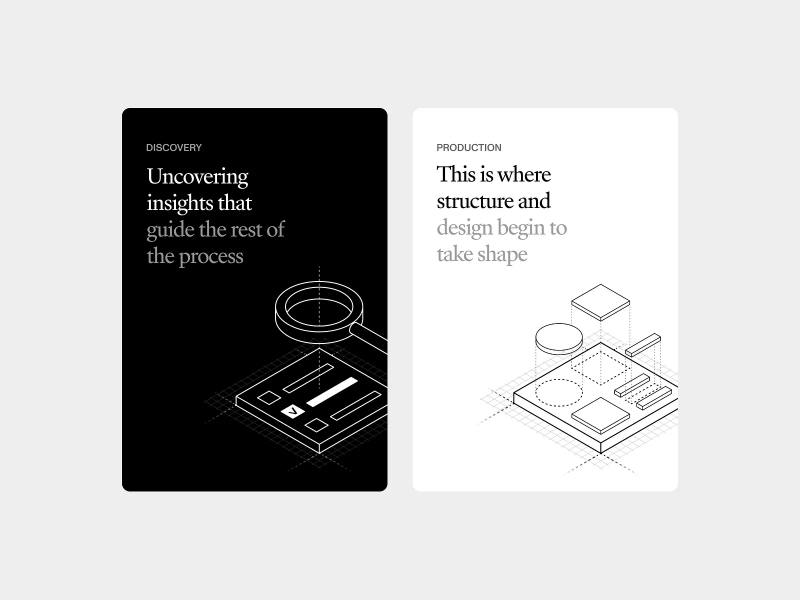
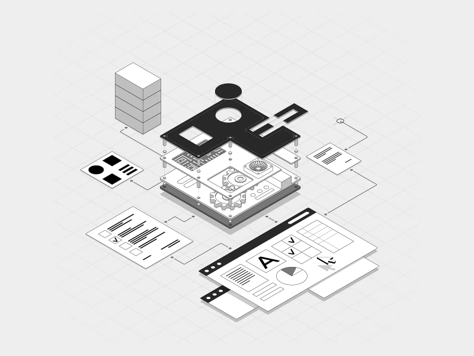

Color does much more than make an interface look attractive. It helps people understand what they
can click, where they should look next, whether something went wrong, and which parts of a page
matter most.

A red error message catches the eye for a reason. A muted gray element tends to disappear into the
background. A bright button surrounded by neutral colors becomes an obvious next step.

But color psychology in UI design is not as simple as saying blue means trust or green increases
conversions.

Context matters.

The same color can communicate completely different things depending on the product, audience,
culture, surrounding colors, and even the device being used.

So instead of looking for a perfect color, it is more useful to understand what color actually does
inside an interface.



## Color Is Part of the Interface Language

Imagine opening a checkout page where every element has roughly the same visual weight.

The product name is blue. The price is blue. The navigation is blue. The checkout button is blue.
Several promotional labels are also blue.

Nothing is technically wrong, but there is no obvious place to look.

Now make most of the interface neutral and give the primary checkout button a strong accent color.

The page immediately becomes easier to scan.

That is one of the most useful jobs color performs in UI design: it creates hierarchy.

It can tell users:

- this is interactive
- this is important
- something went wrong
- the operation succeeded
- this action is dangerous
- these elements belong together

The important part is consistency.

If red means "delete" on one screen but "save" on another, the color stops helping and starts
creating uncertainty.

## Color Psychology Is Not a Universal Formula

People often attach fixed meanings to colors.

Blue means trust.

Green means success.

Red means urgency.

Yellow means happiness.

These associations can be useful starting points, but treating them as universal rules is risky.

Color perception depends on context.

A bright red button on a shopping page might communicate urgency:

```text
Buy now
```

Put the same red next to a failed payment and its meaning changes completely:

```text
Payment failed
```

Nothing about the RGB value changed. The surrounding interface changed its meaning.

Culture matters too.

Colors associated with celebration in one part of the world may carry completely different meanings
somewhere else. Industry expectations also influence perception. A palette that feels natural for a
gaming platform may feel strange in an investment dashboard.

This is why color psychology works better as a design tool than as a collection of rigid rules.

## Red: Attention, Urgency, and Danger



Red is difficult to ignore.

That makes it useful when an interface needs to communicate something important.

You will often see it used for:

```text
errors
destructive actions
critical warnings
failed operations
urgent notifications
```

Consider a delete action:

```text
Cancel    Delete account
```

Giving the destructive button a red treatment helps separate it from an ordinary action.

The same principle works with validation:

```text
Email

hello@example

Please enter a valid email address.
```

A red border and error message make the problem easier to locate.

But color should not carry the entire message. A red border without text, an icon, or another
indicator can be difficult for users with color vision deficiencies to interpret.

Red also loses its power when everything is red.

If the background, buttons, labels, banners, and notifications all compete with the same intense
color, the interface becomes exhausting rather than urgent.

Use strong colors selectively.

## Blue: Stability and Familiarity



Blue appears everywhere in software, particularly in financial products, communication tools,
enterprise applications, and dashboards.

Part of its usefulness comes from familiarity.

Users have seen blue used for links, primary actions, navigation, and corporate interfaces for
years. It often feels predictable rather than disruptive.

That makes it a practical choice for interfaces that need to feel calm and structured.

For example:

```text
Account balance

$12,480.00

[ View transactions ]
```

A restrained blue accent can distinguish the primary action without making the interface feel
aggressive.

But blue is not automatically trustworthy.

A poorly designed financial product does not suddenly become credible because its buttons are blue.

Typography, spacing, copy, interaction design, brand reputation, performance, and security signals
all contribute to that perception.

Color is only one piece.

## Green: Success and Positive States



Green has become closely associated with successful operations in digital interfaces.

You save a document:

```text
File saved successfully
```

A payment completes:

```text
Payment received
```

A deployment finishes:

```text
Deployment successful
```

Users often recognize the meaning before reading the entire message.

That is valuable because interface feedback should be quick to understand.

Green also works naturally in products related to nature, sustainability, health, growth, and
finance.

Still, relying only on a green color is a mistake.

Compare:

```text
● Payment complete
```

with:

```text
✓ Payment complete
```

The second example remains understandable even when the color is difficult to distinguish.

Color should reinforce meaning rather than become the only source of meaning.

## Yellow: Attention Without an Emergency



Yellow sits in an interesting position.

It attracts attention but usually feels less severe than red.

That makes it useful for warnings and information that deserves attention without necessarily
representing a failure.

For example:

```text
Your subscription expires in 3 days.
```

The message matters, but the account has not stopped working.

Yellow can also work well for:

```text
new features
temporary notices
promotional labels
status warnings
highlighted information
```

Its biggest weakness is readability.

Bright yellow backgrounds paired with light text can produce terrible contrast. Large areas of
saturated yellow can also become tiring.

It often works better as an accent than as the dominant interface color.

## Orange: Energy and Action



Orange combines some of the visibility of red with a friendlier character.

That is why it frequently appears in:

```text
commerce
entertainment
promotions
CTA buttons
notifications
```

On a mostly blue or gray interface, an orange CTA can stand out immediately.

```text
Choose your plan

Starter
Professional
Business

[ Start free trial ]
```

The useful property here is not some hidden psychological ability of orange to make people buy
things.

It is contrast.

If orange is rare everywhere else on the page, the button becomes visually important.

That distinction matters.

The best CTA color is usually not "orange" or "green." It is a color that fits the brand,
communicates the right meaning, remains accessible, and separates the action from its surroundings.

## Black: Contrast, Focus, and Premium Design



Black is strongly associated with minimalism and premium visual identities.

Fashion, photography, luxury products, and creative portfolios often use dark interfaces because
images and typography can stand out dramatically against them.

A restrained palette might contain little more than:

```text
black
off-white
gray
one accent color
```

That can create a very focused visual hierarchy.

But dark interfaces need careful handling.

Large blocks of bright text on pure black can be uncomfortable to read. A page filled with dark
surfaces and little spacing may feel dense rather than sophisticated.

Dark design works best when contrast, typography, spacing, and visual rhythm are considered
together.

## White: Space Is Also a Design Element



White is easy to overlook because designers often think about it as the absence of color.

In practice, white space is one of the strongest tools for organizing an interface.

Consider this:

```text
Dashboard
Revenue
$48,200
Customers
1,284
Orders
382
```

Now imagine every piece of information packed tightly together.

Even if the typography and colors remain identical, comprehension becomes harder.

Spacing separates concepts.

It creates groups, establishes rhythm, and gives important elements room to stand out.

A mostly white interface can therefore feel simple and organized, but only when that empty space has
structure.

Random empty areas do not automatically create good minimalism.

## Purple: Creativity and Distinction


Purple is common in products that want to feel creative, experimental, expressive, or premium.

You often find it around:

```text
creative software
AI products
beauty brands
fashion
entertainment
gaming
```

It is particularly useful when a brand wants to move away from the familiar blue palette of
traditional software.

But purple covers a huge visual range.

A pale lavender interface communicates something very different from a nearly black violet
background.

This is another reason broad statements such as "purple means luxury" should be treated carefully.

Hue matters, but saturation, brightness, contrast, typography, imagery, and surrounding colors can
change the final impression completely.

## Color Creates Visual Hierarchy


Suppose a page contains three actions:

```text
Save changes
Cancel
Delete account
```

Making all three identical forces the user to read each one before understanding its importance.

A hierarchy can make the relationship clearer:

```text
[ Save changes ]     Cancel

Delete account
```

The primary action gets the strongest visual treatment.

The secondary action becomes quieter.

The destructive action uses a separate semantic treatment.

This is much more useful than assigning colors based purely on decoration.

Color should answer a question:

Why does this element need attention?

If there is no good answer, it probably does not need another accent color.

## Too Many Accent Colors Destroy Hierarchy

Imagine five buttons sitting next to each other:

```text
[Red] [Orange] [Green] [Blue] [Purple]
```

Each one is trying to be important.

The result is that none of them is.

This is a common problem in dashboards and SaaS products. Designers introduce a new color every time
they need to distinguish another feature.

Eventually the interface becomes a collection of competing signals.

A simpler system works better:

```text
Primary action       strong accent
Secondary action     neutral
Destructive action   danger
Disabled action      muted
```

Now color has meaning.

Users can learn the system instead of decoding every screen from scratch.

## Contrast Matters More Than the "Perfect" Color

One of the biggest mistakes in discussions about color psychology is focusing on hue while ignoring
contrast.

Consider a CTA.

A green button may disappear on a green-heavy page.

An orange button may become extremely obvious on that same page.

Move the orange button onto an orange background and the advantage disappears.

This means:

```text
button color
```

cannot really be evaluated without:

```text
button color
+
background
+
surrounding content
+
button size
+
spacing
+
typography
```

Color is relational.

It works because of what surrounds it.

## Accessibility Changes the Rules

A beautiful palette is useless when people cannot read it.

Contrast therefore needs to be considered from the beginning rather than checked at the end.

For regular text, WCAG guidance commonly uses a minimum contrast ratio of:

```text
4.5:1
```

For large text:

```text
3:1
```

But contrast is only one part of accessible color design.

Do not communicate important information using color alone.

Instead of:

```text
●
```

use something closer to:

```text
✓ Payment successful
```

Instead of changing only the input border:

```text
Email
[                ]
```

provide an explanation:

```text
Email
[                ]

Enter a valid email address.
```

Icons, labels, patterns, and shapes can support the color signal.

The interface remains understandable even when the user perceives its colors differently.

## Do Not Forget Interaction States

A button is not a single static rectangle.

It may have:

```text
default
hover
focus
active
disabled
loading
```

states.

All of them need to remain readable.

For example:

```css
.button {
	background: #1d4ed8;
	color: white;
}

.button:hover {
	background: #1e40af;
}

.button:focus-visible {
	outline: 3px solid #93c5fd;
	outline-offset: 2px;
}

.button:disabled {
	opacity: 0.5;
	cursor: not-allowed;
}
```

The exact colors will depend on the design system, but the principle remains the same.

Color has to work during interaction, not just in a static Figma frame.

## Color Can Reduce Cognitive Load

Imagine a project management application containing dozens of tasks.

Without visual grouping, every row requires deliberate reading.

Now introduce a simple status system:

```text
Urgent       red
Waiting      yellow
In progress  blue
Completed    green
```

A user can scan the board much faster.

But again, labels still matter.

```text
● Urgent
● Waiting
● In progress
● Completed
```

Color speeds up recognition while text preserves clarity.

That combination is more robust than either one alone.

## Color and CTA Buttons

There is no universally best CTA color.

The best choice depends on the interface around it.

Suppose your page uses mostly:

```text
navy
light blue
white
gray
```

A warm accent might make the main CTA easier to find.

On another site built around orange branding, that same orange CTA could disappear.

Instead of asking:

> Which button color converts best?

ask:

> Does the primary action clearly stand out from everything around it?

That is a much more useful design question.

## Color Does Not Guarantee Conversion

You will often find case studies claiming that changing a button from one color to another increased
conversion by a specific percentage.

Such experiments can be useful, but their conclusions are easy to oversimplify.

If a green button beats a red one, it does not prove:

```text
green converts better than red
```

It might simply mean the green version had stronger contrast in that particular layout.

Other factors can also affect the result:

```text
traffic source
audience
copy
button position
surrounding elements
device
sample size
experiment duration
```

Treat color changes as hypotheses rather than universal discoveries.

## Test a Hypothesis, Not a Color

A useful A/B test starts with a reason.

Bad hypothesis:

```text
Green buttons convert better.
```

Better:

```text
Increasing the contrast of the primary CTA will make
it easier to notice and increase the percentage of
users who begin checkout.
```

Now the experiment has a clear idea behind it.

You can measure:

```text
CTA click-through rate
checkout starts
completed purchases
time to action
error rate
```

Even if the new color wins, the lesson is about the design hypothesis, not about discovering a
magical hex value.

## Common Color Mistakes in UI Design

### Too Many Accents

When every card, icon, heading, and button gets its own bright color, hierarchy disappears.

Pick a primary accent and use additional semantic colors with a clear purpose.

### Weak Contrast

Light gray text on a white background may look elegant in a mockup but become frustrating on a
laptop in daylight.

Design for real viewing conditions.

### Color as the Only Signal

Never make users distinguish success from failure only by seeing green versus red.

Add text, icons, or another visual cue.

### Ignoring Context

A fashionable palette is not automatically appropriate for every product.

A playful combination that works beautifully for a creative tool may feel completely wrong for
banking software.

### Inconsistent Meaning

If green means success in one part of the application, do not suddenly use it for a destructive
action elsewhere.

Consistency allows users to learn your interface.

## How to Choose a Product Color Palette

A useful palette begins with the product, not with a color wheel.

Start with three questions.

### What Should the Product Communicate?

Write down a few qualities.

Maybe the product should feel:

```text
reliable
fast
playful
technical
premium
calm
creative
```

Do not immediately translate each word into a color.

Use them to establish a visual direction first.

### Who Will Use It?

Look at the audience and the interfaces they already understand.

A professional analytics platform and a social app for teenagers probably should not speak exactly
the same visual language.

That does not mean blindly copying competitors.

It means understanding the expectations users bring with them.

### Where Will the Interface Be Used?

Context matters.

An interface frequently used outdoors may require stronger contrast.

A dashboard viewed for eight hours a day should avoid unnecessary visual intensity.

An entertainment product can usually tolerate more expressive color choices than software used for
monitoring critical systems.

The environment changes what "good color" means.

## Build a Small Color System

Instead of collecting random hex values, define roles.

For example:

```css
:root {
	--color-primary: #2563eb;
	--color-danger: #dc2626;
	--color-success: #15803d;
	--color-warning: #ca8a04;

	--color-text: #18181b;
	--color-text-muted: #71717a;

	--color-background: #ffffff;
	--color-surface: #f4f4f5;
	--color-border: #e4e4e7;
}
```

Now components consume semantic values:

```css
.button-primary {
	background: var(--color-primary);
}

.message-error {
	color: var(--color-danger);
}

.message-success {
	color: var(--color-success);
}
```

This is easier to maintain than scattering unrelated colors throughout a codebase.

More importantly, it gives color a role.

You are designing a system rather than decorating individual components.

## A Simple Rule to Remember

Color should make an interface easier to understand before it makes the interface more interesting.

Use it to establish hierarchy.

Use it to communicate state.

Use it to guide attention.

Make sure important information survives without color.

Then test the result with actual users and real product data.

Color psychology can give you useful starting points, but it cannot tell you which exact shade will
work for every audience and every product.

There is no magic blue for trust, green for conversion, or orange for sales.

There is only context, contrast, consistency, accessibility, and testing.

That is where color becomes part of good UX rather than decoration.
