## Introduction: Why the Digital World Misses the Past

Nostalgia in digital product design is no longer just a soft spot for bygone eras. Today it
functions as a deliberate UX strategy. Familiar visual metaphors, tactile surfaces, and retro
typography lower the mental barrier to entry. Users find products easier to navigate when they tap
into a subconscious sense of familiarity.

After years of hyper-polished interfaces and rigid design systems, digital UI is pulling a sharp
turn back toward skeuomorphism, raised buttons, pixel art, and the raw visual energy of the turn of
the millennium.

> **Why are modern interfaces intentionally aging themselves?** Is this a pushback against banner
> blindness in an era of copy-paste frameworks, a rebellion against lifeless minimalism, or
> calculated emotional marketing? Let us break down how retro patterns are reclaiming our screens.

---

## What Is Driving the Retro Revival in UI?

The resurgence of vintage trends isn't just a passing mood among art directors. It is a systemic
reaction to how our relationship with technology has evolved.

### 1. Minimalist Burnout & Digital Fatigue

The past decade pushed digital design toward extreme simplification through flat elements, identical
sans-serifs, muted palettes, and standardized design systems. While this made building products
faster, it stripped them of their personality. Overwhelmed by constant digital noise, users are
tired of sterile, clinical screens. Textures, gradients, depth, and tangible metaphors bring back a
sense of humanity and warmth, serving as a direct counterweight to endless white space.

### 2. Seeking Comfort in Predictable Eras

From vinyl sales and film cameras to endless movie reboots, nostalgia has swept broader culture. In
uncertain times, the past feels safe and predictable. Interfaces are simply adapting to this shift.
They borrow visual languages from simpler times to offer users emotional grounding and comfort.

### 3. Gen Z & Borrowed Nostalgia

While Millennials mourn the digital era of their youth, Gen Z frequently romanticizes a period they
barely lived through. To younger generations, the 90s and Y2K represent an optimistic, naive, and
visually expressive chapter of the early web. Modern UI does not need historical accuracy here. It
just needs to capture the mood and recognizable symbols.

### 4. Emotional Differentiation for Brands

When most apps share nearly identical feature sets, visual identity becomes the ultimate
differentiator. Retro elements help brands:

- Hook user attention instantly
- Increase visual recall and brand distinctiveness
- Signal authenticity, playfulness, and character

Ultimately, nostalgic UI isn't about copy-pasting the past. It is an intentional modern remix. By
wrapping modern, high-performance tech in warm, nostalgic aesthetics, designers create products that
are both effortlessly functional and emotionally resonant.

---

## The Y2K Phenomenon: How Turn-of-the-Century Aesthetics Took Over

Y2K is arguably the loudest retro movement in modern product design. It represents the visual
language of the late 1990s and early 2000s, blending early web culture, rave aesthetics, sci-fi
optimism, and a naive belief that technology was about to change everything for the better.

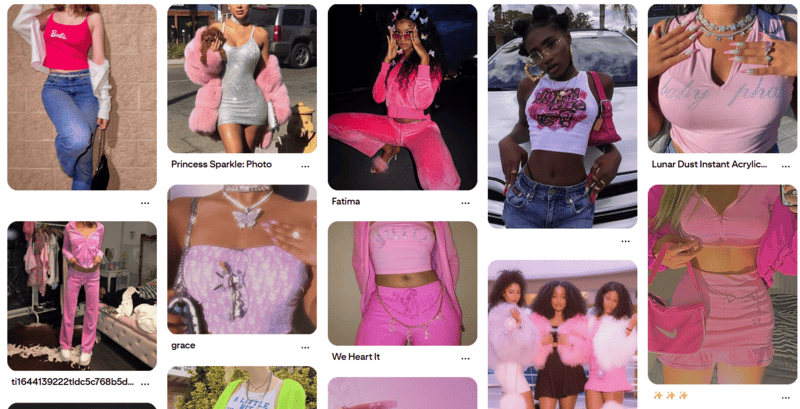

```
Anatomy of the Y2K Aesthetic:
[ High-Gloss & Chrome ]  •  [ Neon Accents ]  •  [ Organic "Blob" Shapes ]
[ Tactile Plastics ]     •  [ Display Fonts ]  •  [ Vibrant Gradients ]

```

Crucially, modern Y2K design does not try to clone early 2000s interfaces word for word. Nobody
wants table-based layouts or broken Flash animations back. Instead, it pulls from the era's cultural
backdrop: CD covers, rave flyers, futuristic 3D renders, and early digital art.

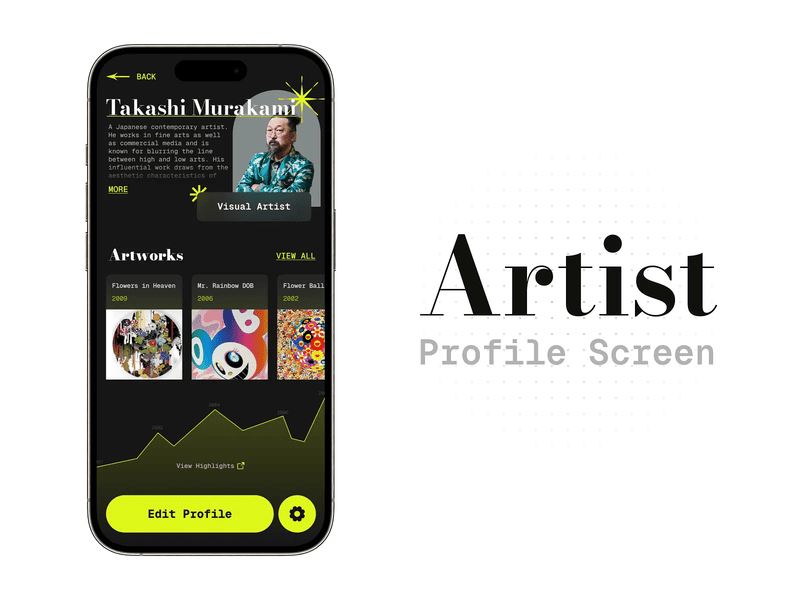

### Real-World Application

Industry leaders like **Spotify** deploy Y2K cues surgically so they do not compromise core
usability. They use them in interactive campaign microsites, personalized year-end reviews,
high-impact landing pages for feature launches, and curated playlist artwork.

This approach highlights the core strength of Y2K in UI. It introduces personality and bold visuals
without throwing usability out the window. Instead of forcing a total retro overhaul, designers use
Y2K as an accent to enliven the product, highlight ties to pop culture, and make the overall user
journey memorable.

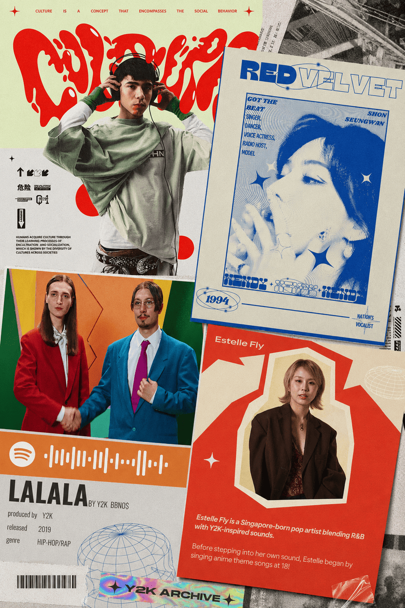

---

## Retrofuturism: Reimagining Yesterday's Tomorrow

The rise of retrofuturism stems from a distinct psychological shift. Modern technologies like
artificial intelligence, pervasive automation, and silent algorithms are increasingly viewed with
anxiety and a sense of lost control. Retrofuturism offers a refreshing detour. Here, technology is
not a threat but an adventure, a discovery, and a promise of a brighter world. It revives the
romance of progress that once accompanied scientific breakthroughs.

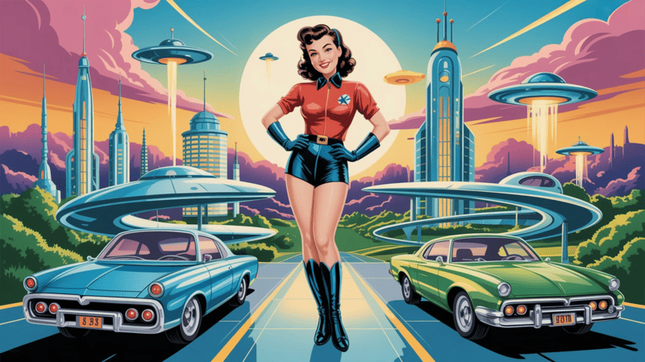

Digital products lean on this style precisely where they need to soften complexity or overcome user
skepticism. You will see it most often in AI platforms, crypto projects, gaming, and experimental
sites.

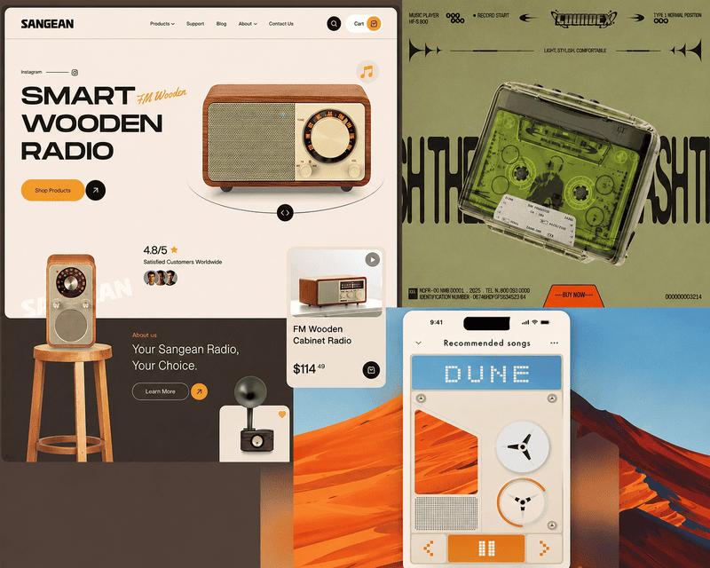

### Sci-Fi Aesthetics (1960s to 1980s)

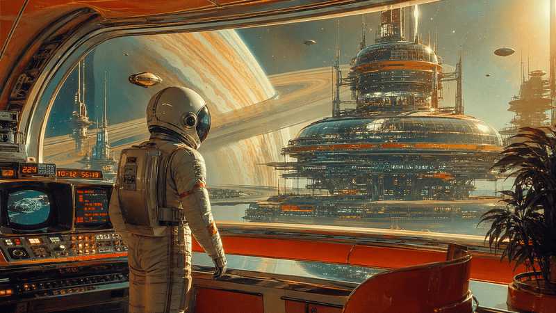

One of the most recognizable layers of retrofuturism is the vintage sci-fi look.

- Pseudo control panels and toggle switches
- Abstract data diagrams and glowing vector lines
- Oscillograms and scientific telemetry symbols

These decorative data elements rarely interfere with primary UI tasks. Instead, they live inside
hero sections, onboardings, and illustrations, casting a sense of advanced systems without
cluttering daily navigation.

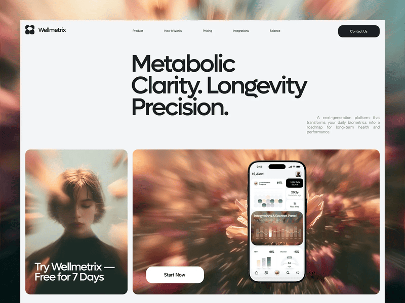

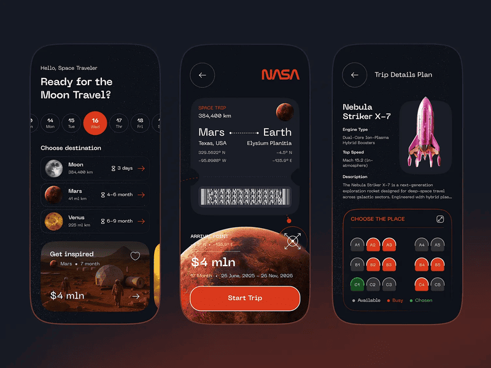

### Vaporwave and Cyberspace Nostalgia

On the other side of retrofuturism lies vaporwave. Rooted in late 80s and 90s electronic music
culture, vaporwave captures what the future used to look and sound like. Sunset gradients, wireframe
horizon grids, primitive 3D renders, neon pinks, and purple palettes create an unmistakably moody
tone. Yet vaporwave does not merely romanticize yesterday. It carries a layer of irony. Glossy
geometric shapes sit beside vast empty spaces, echoing our complex love-hate relationship with
technological progress.

Retrofuturism acts as an emotional layer in UI. It injects depth and grand ideas into a product
without causing cognitive overload. It tells a story about a future that feels understandable,
cinematic, and far less intimidating than reality.

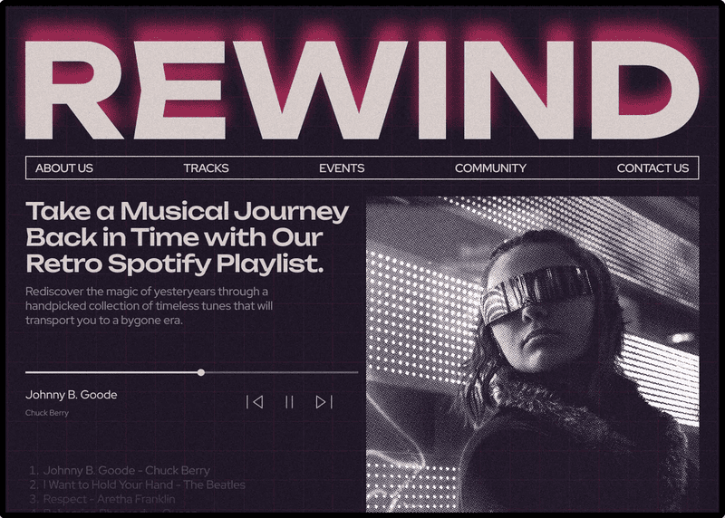

---

## Digital Brutalism: Honesty Over Polished Politeness

Digital brutalism is often misunderstood as intentionally broken or unnavigable design. That is a
misunderstanding. Modern digital brutalism balances raw provocation with systematic order. It can
feel abrasive and unpolished, or it can rely on a remarkably clear grid with razor-sharp
readability. Its true goal is not chaos. It is a total rejection of corporate politeness and
artificial smoothness.

From a nostalgic standpoint, brutalism is a clear retro phenomenon. It reaches back to Web 1.0 and
the early 2000s, when websites were straightforward, technical, and unconcerned with hiding their
mechanics. Buttons looked like native buttons, text looked like plain text, and page architecture
sat right on the surface. Replicating this visual language today works as a nostalgic nod to a time
when the internet was a functional tool rather than a hyper-optimized commercial product.

Visually, brutalism embraces unyielding techniques:

```
Brutalist Characteristics:
[ Monospaced Fonts ]   •  [ Stark High-Contrast ]  •  [ Limited Color Palettes ]
[ Oversized Headlines ] •  [ Raw Flat Elements ]    •  [ Visible Grid Lines ]
```

Because brutalist interfaces rely on strict logic, their information hierarchy is often easier to
read than in classical minimalism. The structure simply does not hide behind soft drop shadows,
rounded corners, or micro-interactions.

This explains why brutalism is favored by projects seeking an uncompromising voice. Creative
agencies and design studios use it to showcase bold perspectives. Museums and cultural institutions
adopt it as part of a curated statement. Municipal and public projects leverage it to highlight a
non-commercial, authentic ethos. In these spaces, brutalism operates as a design manifesto that
demands attention.

## 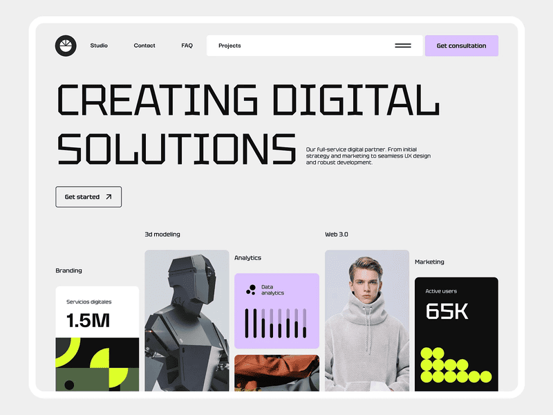

## Skeuomorphism: The Return of Depth and Tactile Metaphors

Skeuomorphism remains one of the most direct nostalgic styles in UI. It mirrors physical objects:
buttons look pushable, surfaces display weight, and interface elements mimic real-world materials
like leather, metal, and glass. For many users, this visual language instantly recalls early desktop
applications and early mobile operating systems.

When flat design replaced skeuomorphism years ago, the change was celebrated as a move toward
digital maturity. Yet as interfaces grew ultra-flat, they lost tactile feedback and emotional
character.

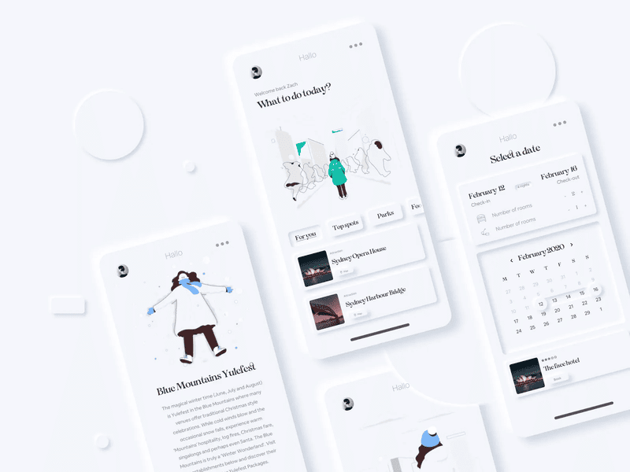

Today skeuomorphism is making a comeback in a refined form. Designers use subtle drop shadows,
layered depth, glassmorphism, and soft volume. Rather than copying real objects directly, modern UI
uses subtle physical cues that make digital environments feel tangible again.

This comeback is driven as much by usability as by aesthetics. Depth and physical cues lower
cognitive load, especially across complex or feature-dense screens. Users grasp clickable targets
and visual relationships much faster. In an age of complex software, soft skeuomorphism acts as an
anchor that restores clarity and user confidence.

## 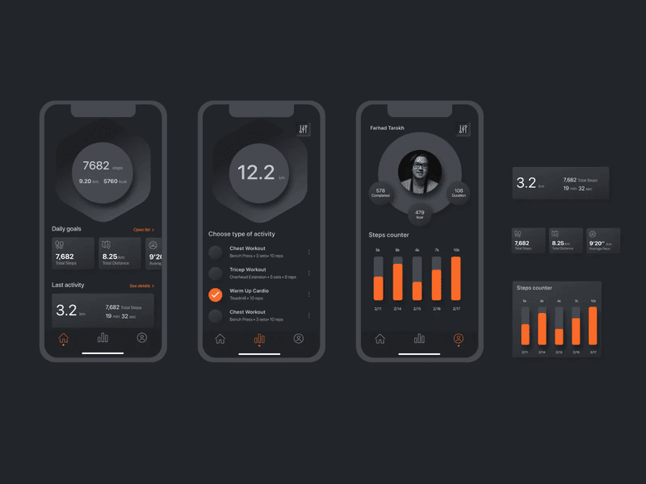

## The Early Web: Embracing the DIY Internet

The early web aesthetic reflects nostalgia for an internet that existed before algorithms, endless
feeds, and homogenized design systems. HTML tables, system fonts, raw primary colors, and exposed
structures bring us back to Web 1.0, when websites felt like personal tools rather than conversion
funnels.

Indie projects, personal portfolios, niche brands, and cultural initiatives frequently adopt this
language today. The look immediately communicates a non-corporate identity, highlighting
independence and a DIY approach. The interface ceases to be an invisible container and instead
announces that a human creator stands behind it.

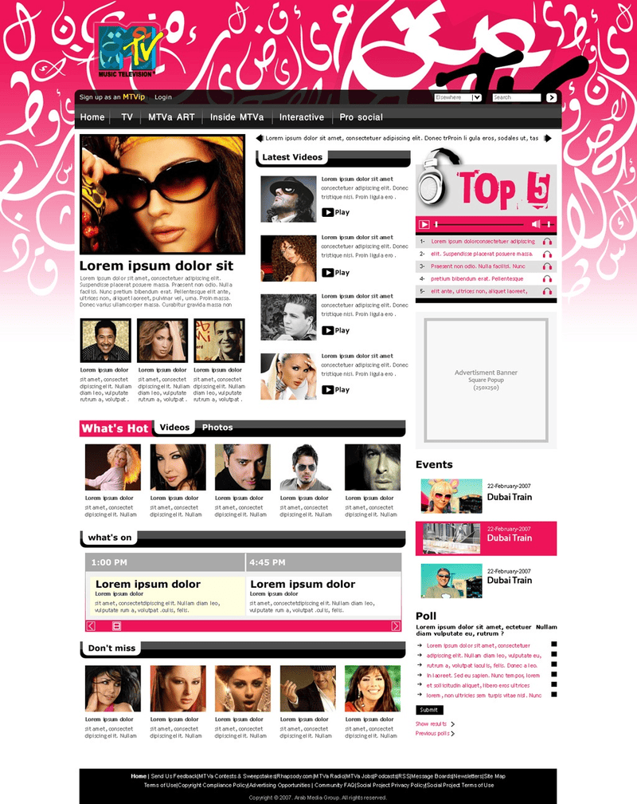

Modern early web aesthetics are a conscious stylistic choice rather than a technical constraint.
Designers use historical limitations as expressive tools. The absence of heavy scripts, complex
animations, and tracking tools builds instant trust. The site does not attempt to manipulate
attention or hide its purpose.

Against the backdrop of digital noise, early web design offers an alternative vision. It recalls the
internet as a space for creative freedom, experimentation, and personal expression where genuine
connection matters more than engagement metrics.

---

## Conclusion

Nostalgia in UI is neither a cheap trick nor a desperate step backward. It is a deliberate effort to
re-examine past visual languages and bring back what years of relentless optimization stripped away:
emotion, character, and a human touch.

Y2K, retrofuturism, brutalism, skeuomorphism, and early web aesthetics rely on different visual
codes, but they share a core realization. Users care about how an interface feels just as much as
how fast it works.

This trend is a natural reaction to sterile design. When every app looks identical, the products
that dare to show personality win. Nostalgic styles allow brands to stand out, form genuine bonds,
and tell stories instead of merely serving basic workflows.
